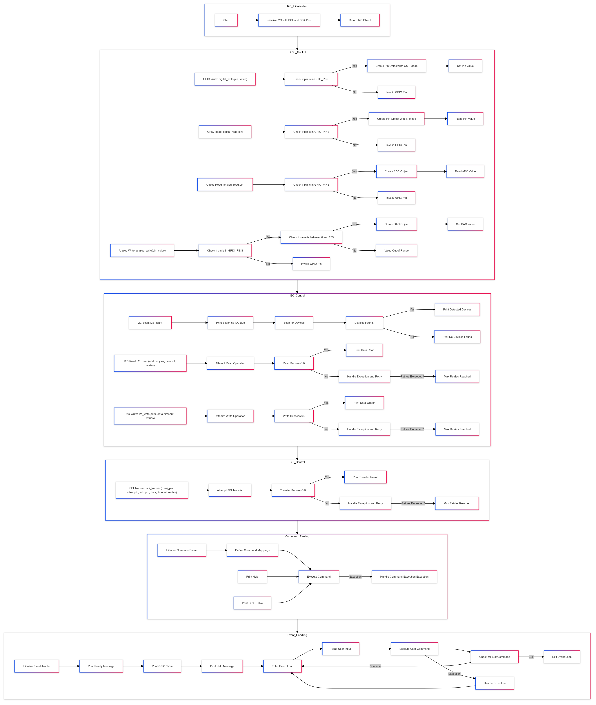

 
# ESP32 GPIO Control System

## Overview

This project is a comprehensive ESP32-based GPIO control system, featuring functionalities for controlling GPIO pins, interacting with I2C and SPI devices, and handling events with power management options. The system is designed to be highly extensible, allowing users to easily add new functionalities or modify existing ones. It supports both digital and analog I/O operations, I2C device communication, and SPI data transfer.

## Features

- **Digital I/O Control:** Read from and write to GPIO pins configured as digital inputs or outputs.
- **Analog I/O Control:** Read analog values from ADC pins and write analog values to DAC pins.
- **I2C Communication:** Scan for devices on the I2C bus, read from and write to I2C devices with configurable retries.
- **SPI Communication:** Perform data transfer with SPI devices, including error handling and retries.
- **Command Parsing:** Execute commands via a built-in command parser for easy interaction with the system.
- **Event Handling:** Schedule events and handle them efficiently, with integrated power management features.
- **Power Management:** Support for light and deep sleep modes to conserve power during inactivity.
- **Extensibility:** Easily extend the system with new features or modifications.

## Installation

### Hardware Requirements

- **ESP32 Development Board**
- **Micro-USB Cable** for power and programming
- **I2C Devices** (optional)
- **SPI Devices** (optional)
- **Breadboard and Jumper Wires** for prototyping

### Software Requirements

- **Python 3.x** installed on your machine
- **Thonny IDE** or any other MicroPython-compatible IDE
- **MicroPython Firmware** installed on your ESP32 board

### Setting Up the ESP32

1. **Install MicroPython on ESP32:**
   - Download the latest MicroPython firmware for ESP32 from [here](https://micropython.org/download/esp32/).
   - Flash the firmware to your ESP32 using esptool or the Thonny IDE.

2. **Upload the Project Code:**
   - Open the provided `.py` file in Thonny or your preferred IDE.
   - Connect the ESP32 board to your computer.
   - Upload the code to the ESP32 board.

## Usage

### Initial Setup

1. **Power on the ESP32:**
   - Connect your ESP32 board to a power source using the Micro-USB cable.

2. **Open a Serial Monitor:**
   - Use the Thonny IDE or a serial terminal (e.g., PuTTY) to connect to the ESP32's serial port.

3. **Interact with the System:**
   - Once connected, you'll be greeted with a GPIO table and a list of available commands.
   - You can now begin executing commands as described in the "Command Reference" section below.

### Command Reference

#### GPIO Control

- **`digital_write(pin, value)`**: Write a digital value (0/1) to the specified GPIO pin.
  ```python
  >>> digital_write(2, 1)
  ```
- **`digital_read(pin)`**: Read a digital value (0/1) from the specified GPIO pin.
  ```python
  >>> digital_read(2)
  ```
- **`analog_read(pin)`**: Read an analog value (0-4095) from the specified ADC pin.
  ```python
  >>> analog_read(34)
  ```
- **`analog_write(pin, value)`**: Write an analog value (0-255) to the specified DAC pin.
  ```python
  >>> analog_write(25, 128)
  ```

#### I2C Control

- **`i2c_scan()`**: Scan the I2C bus and return the detected device addresses.
  ```python
  >>> i2c_scan()
  ```
- **`i2c_read(addr, nbytes, timeout=1000, retries=3)`**: Read a specified number of bytes from an I2C device at the given address, with optional timeout and retries.
  ```python
  >>> i2c_read(0x3C, 4)
  ```
- **`i2c_write(addr, data, timeout=1000, retries=3)`**: Write data to an I2C device at the given address, with optional timeout and retries.
  ```python
  >>> i2c_write(0x3C, b'\x00\x01')
  ```

#### SPI Control

- **`spi_transfer(mosi_pin, miso_pin, sck_pin, data, timeout=1000, retries=3)`**: Perform SPI data transfer with specified pins, data, and optional timeout and retries.
  ```python
  >>> spi_transfer(18, 19, 23, b'\x01\x02\x03')
  ```

#### Event Handling & Power Management

- **`sleep_mode(mode)`**: Enter either light or deep sleep mode. Valid modes are `"light"` and `"deep"`.
  ```python
  >>> sleep_mode("light")
  ```
- **`schedule_event(callback, delay_ms)`**: Schedule an event to be executed after the specified delay in milliseconds.
  ```python
  >>> schedule_event(callback_function, 1000)
  ```

#### System Commands

- **`gpio_table()`**: Print the GPIO table, showing available pins and their functions.
  ```python
  >>> gpio_table()
  ```
- **`help()`**: Display the list of available commands and their usage.
  ```python
  >>> help()
  ```

### Extending the System

This project is designed to be extensible, allowing you to add new features or modify existing ones. To add a new command:

1. **Define a new method in the appropriate class** (e.g., `GPIOControl`, `I2CControl`, `SPIControl`).
2. **Register the new command** in the `CommandParser` class by adding it to the `self.commands` dictionary.
3. **Test the new functionality** using the serial monitor.

### Power Management

To conserve power, the system supports both light and deep sleep modes. Use the `sleep_mode` command to put the ESP32 into sleep mode. The system will automatically wake up after the specified duration or based on external interrupts.

### Error Handling & Debugging

The system includes basic error handling for I2C and SPI communications, with retries to ensure reliability. If an error occurs during command execution, an error message will be displayed in the serial monitor. Use these messages to debug issues or refine command logic.

## Flowchart



## Contributions

Contributions to this project are welcome. If you find a bug or have a feature request, feel free to open an issue or submit a pull request. Please ensure that your code follows the style and conventions used in the project.

## License

This project is licensed under the MIT License. See the `LICENSE` file for more details.

## Acknowledgments

This project was developed with inspiration from various open-source MicroPython projects. Special thanks to the MicroPython community for their continuous support and contributions.
